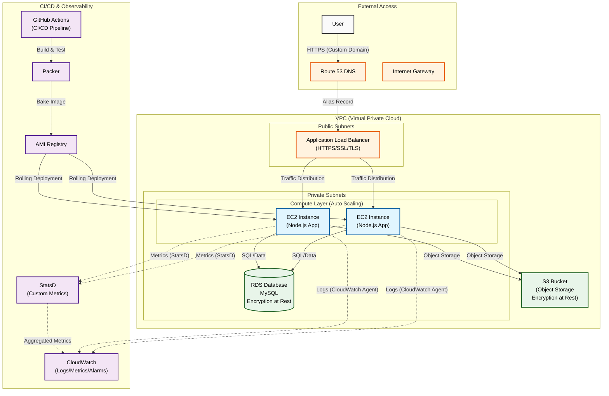

# Cloud-Infrastructure-DevOps

## Architecture




## Tech Stack
- **Backend**: Node.js, Express, Sequelize ORM
- **Database**: MySQL (RDS)
- **Infrastructure**: Terraform, AWS (VPC, EC2, S3, Route53, CloudWatch)
- **CI/CD**: GitHub Actions, Packer
- **Security**: IAM Roles, Security Groups, SSL/TLS, Encryption at Rest


## API Endpoints

| Method | Endpoint | Description |
| :--- | :--- | :--- |
| `GET` | `/healthz` | Health check endpoint (Database connectivity). |
| `POST` | `/v1/file` | Upload a file (Authenticated). |
| `GET` | `/v1/file/:id` | Retrieve file metadata (Authenticated). |
| `DELETE` | `/v1/file/:id` | Delete a file (Authenticated). |
| `PUT` | `/v1/file/:id` | Update file metadata (Authenticated, if supported). |

## Deployment Guide

### Prerequisites
- **Node.js**: For local development and testing.
- **Terraform**: For infrastructure provisioning.
- **Packer**: For building AMIs (automated via CI/CD).
- **AWS CLI**: For managing AWS resources and credentials.

### Configuration

#### Application
1.  Create a `.env` file in `webapp/` with database and app credentials:
    ```
    DB_HOST=...
    DB_USER=...
    DB_PASSWORD=...
    DB_NAME=...
    PORT=...
    ```

#### Infrastructure
1.  Navigate to `tf-aws-infra/`.
2.  Create a `<env>.tfvars` file (e.g., `dev.tfvars`) with required variables:
    *   `region`
    *   `vpc_cidr`
    *   `profile`
    *   `route53_zone_id` (from AWS Route53)
    *   `ssl_certificate_arn` (from AWS ACM)

### Local Development
1.  Install dependencies: `npm install`
2.  Run tests: `npm test`
3.  Start server: `node server.js`

### Infrastructure Provisioning

1.  **Initialize Terraform**:
    ```bash
    terraform init
    ```
2.  **Plan Infrastructure**:
    ```bash
    terraform plan -var-file=<env>.tfvars
    ```
3.  **Apply Configuration**:
    ```bash
    terraform apply -var-file=<env>.tfvars
    ```

### SSL Certificate Setup (One-time)
1.  Generate CSR and Key using OpenSSL.
2.  Purchase/Obtain SSL Certificate.
3.  Import into AWS ACM:
    ```bash
    aws acm import-certificate --certificate fileb://cert.crt --private-key fileb://private.key --certificate-chain fileb://ca-bundle.crt --region us-east-1
    ```
4.  Update `ssl_certificate_arn` in your `.tfvars`.

### CI/CD & Deployment

Deployments are automated via GitHub Actions:
1.  **Build AMI**: Merging a PR triggers Packer to build an AMI with the application code.
2.  **Rolling Deployment**:
    *   The new AMI ID is updated in the Auto Scaling Group Launch Template.
    *   An Instance Refresh is triggered to perform a zero-downtime rolling update.

### Verification
1.  **Health Check**: Access `https://<your-domain>/healthz`.
2.  **Load Testing**:
    ```bash
    ab -n 1000 -c 100 https://<your-domain>/healthz
    ```
3.  **Monitoring**: Check CloudWatch for logs and custom metrics (StatsD).
